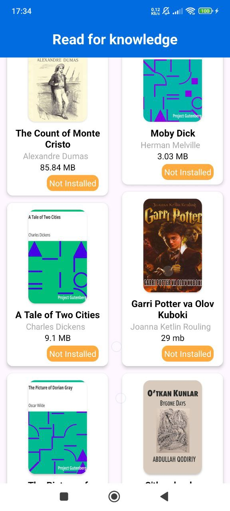
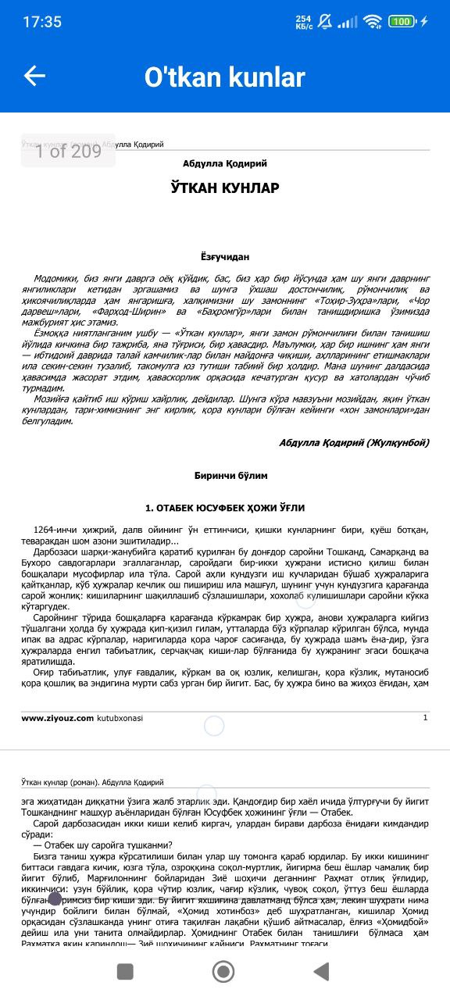

# Read For Knowledge - Android App

Welcome to the **Read For Knowledge** repository! This Android application allows users to download and read books. Built with **Android Native** using **MVVM Architecture**, **Clean Architecture**, and integrated with **Firebase Firestore** and **Firebase Storage** for cloud storage and file handling.

---

### 📚 **App Overview**

**Read For Knowledge** is an Android app designed for book lovers. The app allows users to download books directly from Firebase Storage and read them offline. The app leverages **Firebase Firestore** for storing book metadata and other essential information, providing a seamless and efficient experience.

The app follows **MVVM Architecture** for separation of concerns and maintainability, and **Room Database** for locally storing user data, such as reading progress and preferences.

---

### 🚀 **Features**

- **Download Books**: Users can download books stored in **Firebase Storage** and read them offline.
- **Read Books**: Open and read downloaded books directly from external storage.
- **Firebase Integration**: Metadata and content are fetched from **Firebase Firestore** and **Firebase Storage**.
- **External Storage Handling**: Efficient handling of book files in external storage with read and write permissions.
- **Offline Support**: Once downloaded, books can be read offline.
- **MVVM Architecture**: The app follows the **Model-View-ViewModel (MVVM)** pattern, ensuring clean architecture and better separation of concerns.
- **Room Database**: Stores local data such as user preferences and reading progress.

---

### ⚙️ **Technologies Used**

- **Android Native**: Built using the Android SDK and **Kotlin**.
- **MVVM Architecture**: Follows the **Model-View-ViewModel** pattern for clean architecture and testability.
- **Room Database**: A local database for storing user preferences and reading progress.
- **Firebase Firestore**: Cloud database to store book metadata and information.
- **Firebase Storage**: Stores the actual book files for download and offline reading.
- **External Storage**: Handles reading and writing files in external storage, allowing users to download and read books.
- **Permissions**: Requests runtime permissions for reading and writing files in external storage.

<table>
  <tr>
    <td></td>
  </tr>
  <tr>
    <td></td>
  </tr>
  <tr>
    <td></td>
  </tr>
</table>